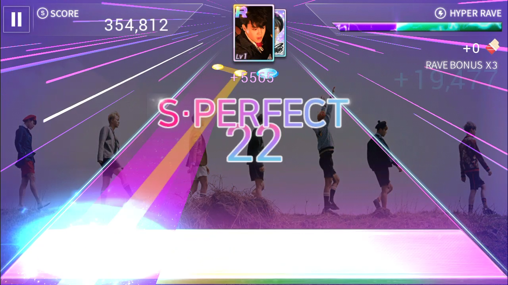

# Superstar BTS
## About the Game

Images 1. Home screen game Superstar BTS

Superstar BTS is a rhythm game developed by Dalcomsoft. This game was released on January 18, 2018 and has been downloaded about 3 million users in 1 month. This game entered Indonesia on February 2018. The song that provides in this game are songs from Korean boy group name BTS.

## Basic Component
### Game Space

Image 2 Game area

In game area there are several things, that is the touch area, health bar, the cards, scores and combo.

### Boundaries
Boundaries in this game are :
- Touch area, in this game there is a touch area that used for hit the beatmaps. If the player hit the beatmaps outside the touch area, then the score will decrease.

- Health bar

Image 3 Critical health bar

Health bar is used for calculating the combo. If player can hit the beatmaps continuously, the health bar will increase up to 4x combo. Otherwise, if player can’t hit inside the touch area, health bar will decrease and the player will lose.

Image 4 Lose screen

-	Score

Image 5 Score screen

Besides playing the song, the player must also collect the cards to be able to increase the score and be top 7 in weekly league.

### Rule of Interaction
Rule of interaction :
- Player must hit the beatmaps inside the touch area. If player can perfectly hit in the center of touch area, the status of combo is Super perfect. If player can’t do perfectly but still inside the touch area, then status of combo is Perfect or Good. But, if player can’t hit inside the touch area, the status is Miss and the player don’t get score.

Image 6 Super perfect combo status

- If player get too many Miss, the health bar will decrease, the song will stop and player will lose.

- Besides playing the song, the player must collect the cards to be able to increase the score and be top 7 in weekly league. Because, if player in top 7 of the league, the player will be promoted to higher weekly league. If player got between 8 to 13, the player will be stay in same league, but, if player lower than 13, the player will demoted to previous league. Total score that calculated for entering weekly league is the sum of the top 5 songs in 5 different albums and 1 weekly song that given random every week.

Image 7 Weekly league

### Artifacts
Artifacts in this game are :
- Beatmap

Image 8 Beatmaps

In this game, the beatmap has 2 types and different color. If the color of beatmap is blue, the player just hit that inside the touch area. But, if the color of beatmap is yellow, the player must swipe the touch area same as direction of the beatmap.

- Song

Image 9 Albums and songs list

In this game there are 13 albums and 100 songs. The player can’t only choose songs, the player can also choose the level of difficulty for each song. The difficulty are easy, normal and hard. But, the difficulty will different in each song depends on the tempo. If the song has slow tempo, the beatmaps will appear tenuous, but if the tempo is fast and contains rap parts, the beatmaps will appear more tightly.

- Card

Image 10 Card inventory

In this game, there are many type of card. The card differentiated by album. In the album, the cards will be differentiated according to the theme of the album.

Image 11 Theme list inside the Young Forever album

Besides that each card also has a grade and the type too, there are C, B, A, S and R, and the grade type are original card, signature card and prism signature card. Level value on the card also varies, there are C with 10 level values, B with 20 level values, A with 30 level values, S with 40 level values and R with 50 level values. The player can power up and upgrade the card to get higher score. Power up can be done with other card in different theme, album, member, grade and level values, but upgrade card can be done just with the same album, member, grade and level values. Player can upgrade the card if they has maximum level values.

Image 12 Card power up

Image 13 Card upgrade

- Headphone, rhythm point, diamond and emerald

Image 14 Headphone, rhythm point, diamond and emerald

In this game, headphone is used as a player's life. The use of the headphone will be different in each level. In easy level they consume 1 headphone, in normal level they consume 2 headphone and in the hard level they consume 3 headphone. The player has maximum headphone that given every day depends on player’s level. 

Rhythm point, diamond and emerald are used for card power up, upgrade and buying items in store. The items that can be buy are card pack, headphone and rhythm point.

### Goal
The goal in this game are :
- Completing a song.
- Completing a song with 3 stars.
- Completing a song with higher score.
- Be top 7 in weekly league.

## Gameplay
### Game Rules
- Player must hit the beatmaps inside the touch area. If player can perfectly hit in the center of touch area, the status of combo is Super perfect. If player can’t do perfectly but still inside the touch area, then status of combo is Perfect or Good. But, if player can’t hit inside the touch area, the status is Miss and the player don’t get score.
- If player get too many Miss, the health bar will decrease, the song will stop and player will lose.
- Besides playing the song, the player must collect the cards to be able to increase the score and be top 7 in weekly league.
- Total score that calculated for entering weekly league is the sum of the top 5 songs in 5 different albums and 1 weekly song that given random every week.

### Plot
- Player collect the card to get higher score. If the rank card higher, the score will higher too.
- Player playing a song without get too many Miss.
- Score that player got will sum for boost the rank in weekly league.

Image 15 Ranking up process

- The calculated score is the sum of the top 5 songs in 5 different albums.
- If player can stay in top 7 in weekly league, the player will be promoted to higher weekly league.
Objectives
- Collect and power up the card for get the better score.
- Playing the song and get high score.
- Stay in top 7 in weekly league until the end of the week.

### Challenges
Challenges in this game are :
- Upgrade the card for get the better score.
- Complete the song and get the 3 stars.
- Play in hard mode and get 3 stars for the better score.
- Stay in top 7 in weekly league until the end of the week.

## Game Mechanics
- Mobility, the player ability to hit the beatmaps inside the touch area.
- Scoring system, the score obtained by the player when they can complete the selected song.